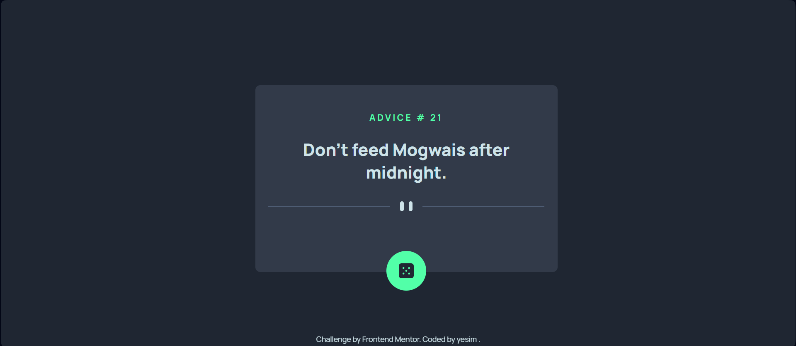

# Frontend Mentor - Advice Generator App Solution

This is a solution to the [Advice Generator App Challenge on Frontend Mentor](https://www.frontendmentor.io/challenges/advice-generator-app-QdUG-13db). This challenge helps developers improve their frontend skills by building real-world projects.

## Table of contents

- [Overview](#overview)
  - [The challenge](#the-challenge)
  - [Screenshot](#screenshot)
  - [Links](#links)
- [My process](#my-process)
  - [Built with](#built-with)
  - [What I learned](#what-i-learned)
  - [Continued development](#continued-development)
  - [Useful resources](#useful-resources)
- [Author](#author)
- [Acknowledgments](#acknowledgments)

## Overview

### The challenge

Users should be able to:

- View the optimal layout for the app depending on their device's screen size
- See hover states for all interactive elements on the page
- Generate a new piece of advice by clicking the dice icon

### Screenshot

Add a screenshot of your solution. You can take a screenshot using the browser's built-in tools or an extension like [FireShot](https://getfireshot.com/).

### Links

- Solution URL: [Add solution URL here](https://github.com/ysmltr/advice-generator-app-main)
- Live Site URL: [Add live site URL here](https://advice-generator-app-main-tpp5.vercel.app)

## My process

### Built with

- Semantic HTML5 markup
- CSS custom properties
- Flexbox
- JavaScript Fetch API
- Mobile-first workflow
- [Advice Slip API](https://api.adviceslip.com) for fetching random advice

### What I learned

During this project, I improved my skills in making API requests and updating the DOM dynamically.

### Continued development

In future projects, I want to:

- Improve the UI with animations and transitions
- Store previous advice to allow users to revisit them
- Add dark mode support

### Useful resources

- [MDN Fetch API Docs](https://developer.mozilla.org/en-US/docs/Web/API/Fetch_API) - Helped me understand API requests better.
- [CSS Tricks Flexbox Guide](https://css-tricks.com/snippets/css/a-guide-to-flexbox/) - Useful for designing a responsive layout.

## Author

- Frontend Mentor - [@ysmltr](https://www.frontendmentor.io/profile/ysmltr)

## Acknowledgments

Thanks to Frontend Mentor for providing great challenges to practice frontend development skills!

